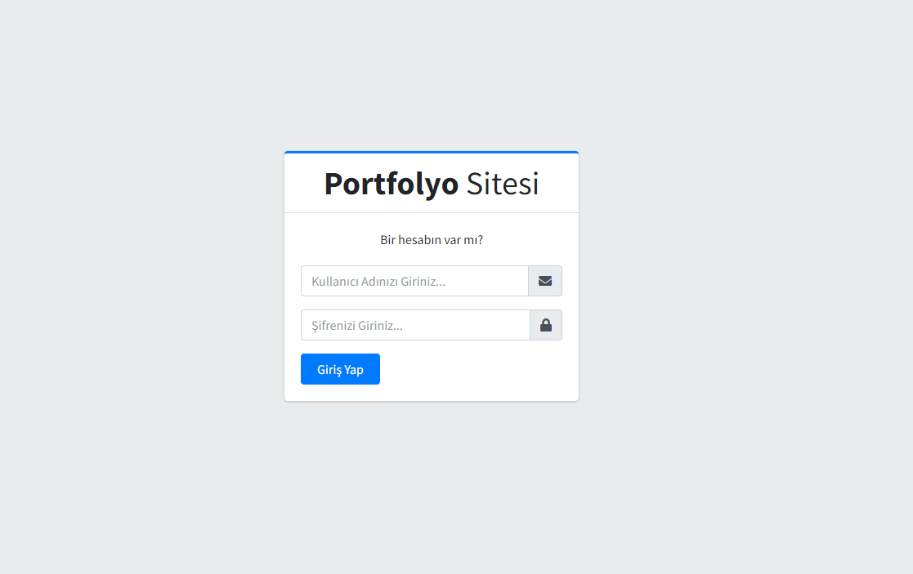
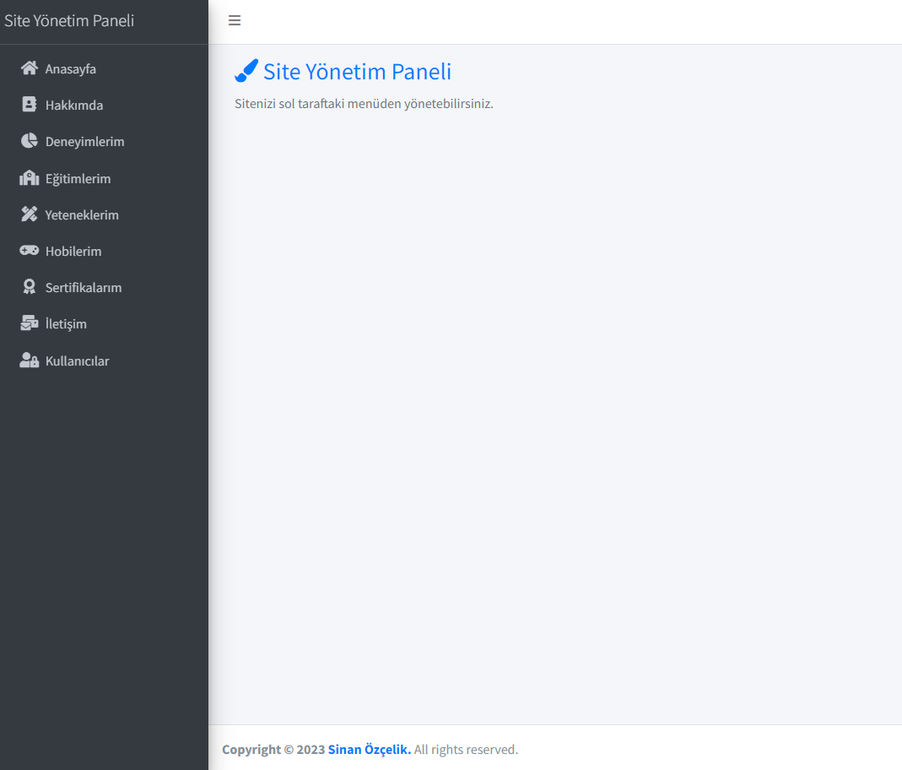
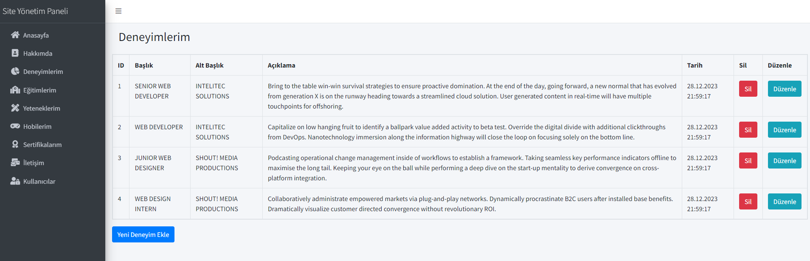
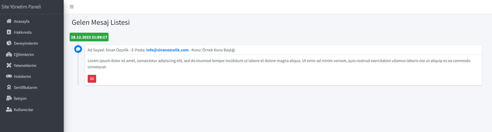
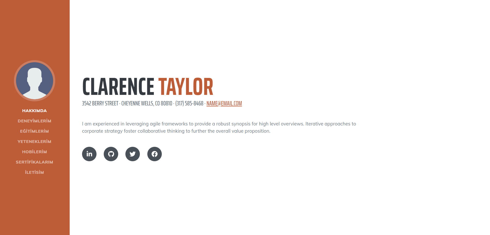
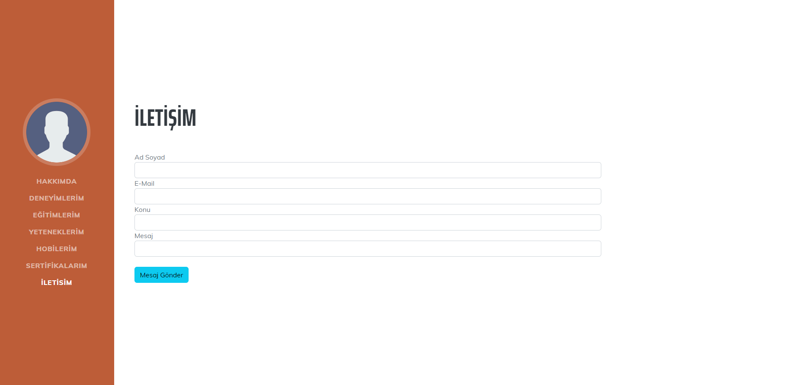

<div align="center">
  
</div>

##  About The Project

This project teaches you how to create modern web applications using the Mvc5 framework. MVC architecture, you will be able to manage your project in a modular and organized way. The created project was developed on the basis of a basic dynamic CV site. This provides a platform where you can easily update your personal and professional information.

The project includes both admin panel and user panel. In this way, it offers a user friendly interface to manage and personalize your project.

```html
<!-- HTML Meta Tags -->
<meta charset="UTF-8">
<meta name="viewport" content="width=device-width, initial-scale=1, maximum-scale=1">
<meta name="author" content="Sinan Özçelik">
<meta name="publisher" content="VS 2023">
<!-- Web Site Title -->
<title>Dynamic Resume Web Site</title>
<!-- Meta Open Graph -->
<meta property="og:locale" content="en_US" />
<meta property="og:type" content="website" />
<meta property="og:title" content="Homepage" />
<meta property="og:url" content="Dynamic Resume Web Site" />
<meta property="og:site_name" content="Dynamic Resume Web Site" />
```

##  Features

- [x] MVC Web Application
- [x] SQL Database Operations
- [x] Linq Queries
- [x] CRUD Operations
- [x] Migration Operations
- [x] User Authentication
- [x] Register / Login Operations
- [x] Sweet Alert


##  Build With


##  Installation

1. Check the database connection on the appsetting.json file. Customize the database connection path here according to your own computer. By default the database name is PortfolioDb.

   ```json
   {
      "Logging": {
         "LogLevel": {
            "Default": "Information",
            "Microsoft.AspNetCore": "Warning"
         }
      },
      "ConnectionStrings": {
         "DefaultConnection": "Data Source=localhost\\SQLEXPRESS;Initial Catalog=PortfolioDb;Integrated Security=True; TrustServerCertificate=True"
      },
      "AllowedHosts": "*"
   }
   ```
2. Type the add-migration command via the Package Manager Console.
   
   ```
   add-migration DbCreateFirst
   ```

3. Type the update-database command via the Package Manager Console.
   
   ```
   update-database
   ```
4. You can use the information below to enter the admin panel. You can use the /Admin/Index address path for the admin panel.
   ```c#
   // --- Identity User Information --- //
   private const string adminUser = "sinanozcelik";
   private const string adminPassword = "Sinan123.";
   ```

## 💻 Project View













##  Contact Information

You can reach out to me using the following contact details:

[](mailto:info@sinanozcelik.com)

[](https://sinanozcelik.com)

I'm always open to development and collaboration. Feel free to reach out to me!